## Powder Model ##

### CV/g of Anodes Made from Cylinders ###

#### CV/g of Cylinders ####

The capacitance of a cylindrical capacitor is given by:

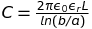

where 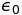 is the permittivity of free space, 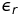 is the relative dielectric constant of the metal oxide,  L is the length of the cylinder, b is the outer radius and a is the inner radius. The thickness of the dielectric is then b-a. The cylinder with dielectric was made by anodizing a cylinder with an orginal radius of R.

The thickness of the dielectric can be written in terms of the native oxide thickness and the formation constant as:

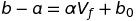

where 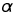 is the formation constant in 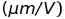and  b0  is the thickness of the native oxide film.

The orginal weight of the cylinder is 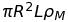. From the above equations, we can derive CV/g:

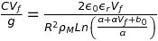

Using stoichiometry and rearranging, we can derive an expression for R2 :

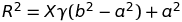

where 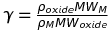 and X is the number of moles of metal per mole of oxide.

Subsituting the expression for R2 into the equation for CV/g gives:

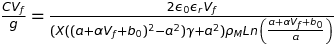

#### Corrected CV/g of Cylinders ####

In the anode made of cylinders, the cylinders touch as shown in this figure (for prismatic cylinders):

This reduces the surface area of the anode. If we define the parameter:

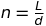

where L is the length of the prism and d is its 'diameter'.

We can write the density of the anode in terms of the density of the metal and n:

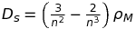

or if we define the fractional density 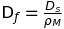 then:

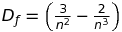

We can also write the corrected CV/g in terms of n:

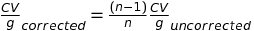

We can then plot the correction factor 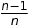 vs. Df 

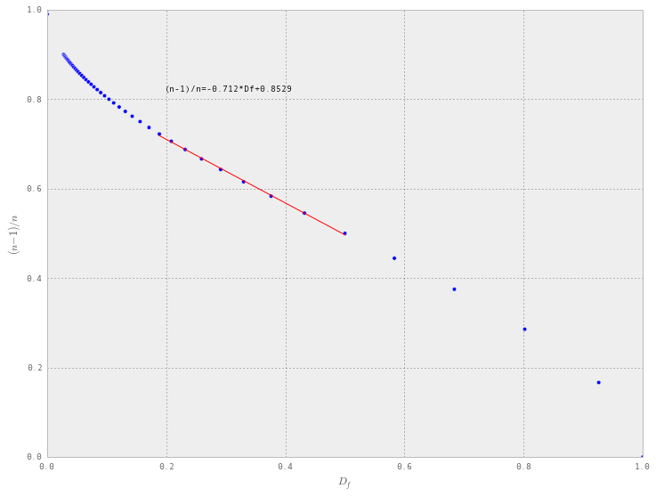

Over the portion of the curve that is nearly linear (say ~0.18 to ~0.5) we can fit a line and then write an expression for CV/gcorrected vs Df:

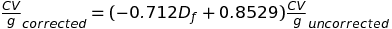
